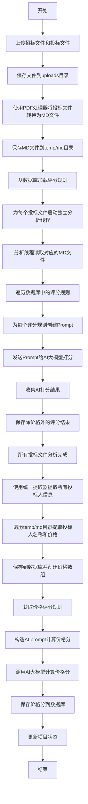

# AI_env2

## 项目概述

AI_env2 是一个基于AI的投标文件分析系统，用于处理PDF格式的招标文件，提取关键信息并进行评分计算。

## 核心功能

- PDF文件处理与结构解析
- OCR识别与文本提取
- 投标价格提取与评分规则分析
- 数据库存储与查询
- 结果展示与导出

## 技术架构

- 后端：Python + Flask
- 前端：Jinja2 + 原生 JS + CSS
- OCR：PyTesseract + pdfplumber + pikepdf + MinerU
- 数据库：SQLAlchemy

## 部署与运行

```bash
# 安装依赖
pip install -r requirements.txt

# 运行服务
python app.py
```

## 投标文件处理与分析流程



## 核心模块

### 1. 统一提取器 (UnifiedExtractor)
- 统一处理投标人名称和投标总价提取
- 避免重复的MD文件处理
- 提供统一的数据提取入口

### 2. 价格计算工作流 (PriceCalculationWorkflow)
- 实现统一的价格提取和计算流程
- 遵循招标文件分析完成后进行价格提取的顺序
- 调用AI大模型计算价格分数

### 3. 智能投标分析器 (IntelligentBidAnalyzer)
- 投标文件智能分析
- AI评分处理
- 进度跟踪和数据库更新

### 4. 评分规则提取器 (CorrectScoringExtractor)
- 从招标文件中提取评分规则
- 支持复杂表格结构识别
- 智能解析评分规则结构

## 常见问题与解决方案

### 1. 关于pydevd警告

在使用VS Code等IDE的调试器运行项目时，可能会遇到以下警告：

```
UserWarning: incompatible copy of pydevd already imported
```

这是由于环境中存在多个版本的pydevd（Python调试器）导致的冲突。这个警告不会影响程序的正常运行，但可以通过以下方式消除：

1. 使用我们提供的`run_without_warnings.bat`脚本运行项目
2. 或者在环境变量中设置`DISABLE_WARNINGS=true`后运行项目

### 2. 高级PDF处理功能

本系统集成了AdvancedPDFProcessor，支持处理图形格式、签名、加密等PDF文件，并能准确识别表格和公式等复杂内容。

#### 特性

- 支持多种OCR技术处理图形格式PDF
- 精确识别表格、公式等复杂内容
- 支持内容级旋转矫正
- 支持加密PDF文件处理
- 输出Markdown格式文档

#### 使用方法

系统会自动检测PDF文件类型并选择最适合的处理方法：
1. 首先尝试直接提取文本
2. 如果文本质量不佳，会自动尝试PyTesseract OCR
3. 如果PyTesseract效果不佳，会尝试OCRmyPDF
4. 最后会使用AdvancedPDFProcessor（MinerU）进行处理
