# 评标系统流程图

## 1. 系统架构概述

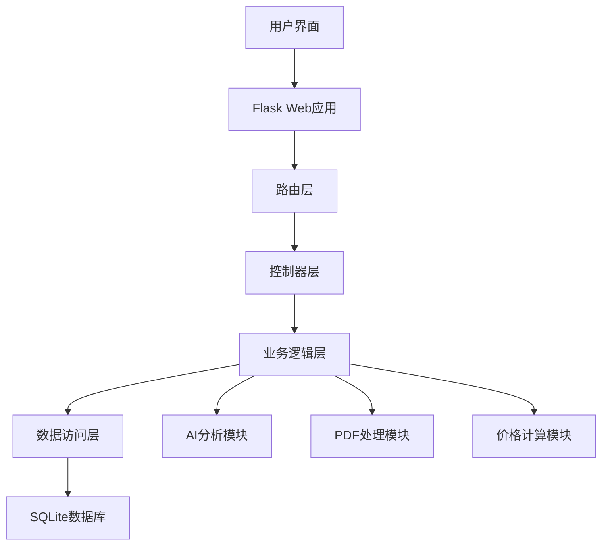

## 2. 项目创建流程

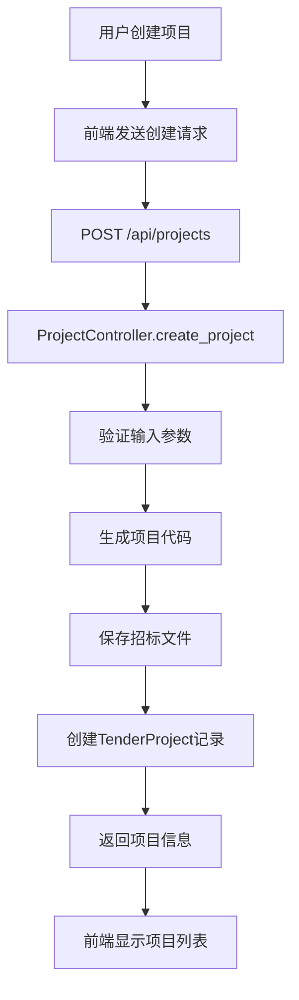

## 3. 投标文件上传流程

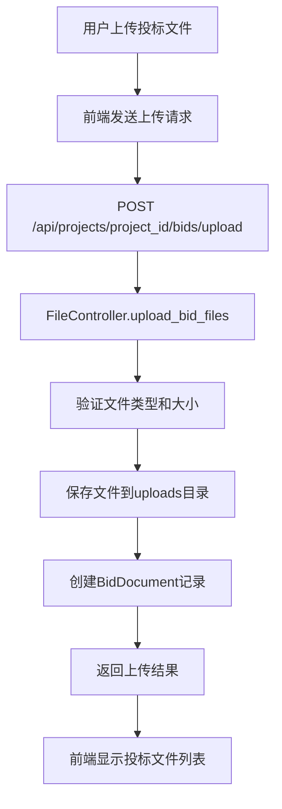

## 4. 投标人名称确认流程

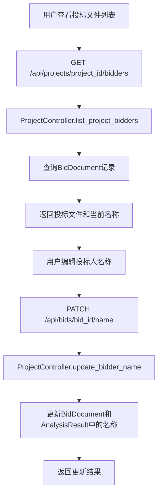

## 5. 项目分析启动流程

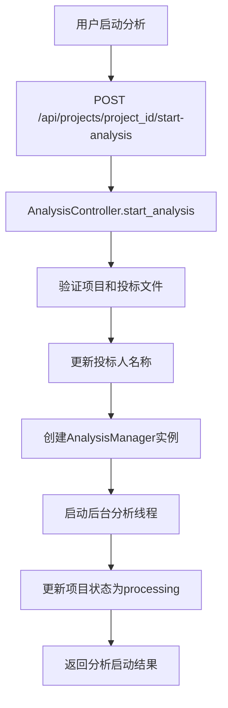

## 6. 核心分析流程

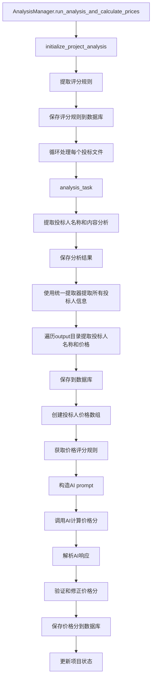

## 7. 单个投标文件分析流程

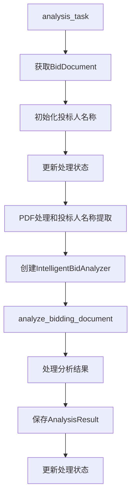

## 8. 投标人名称提取流程

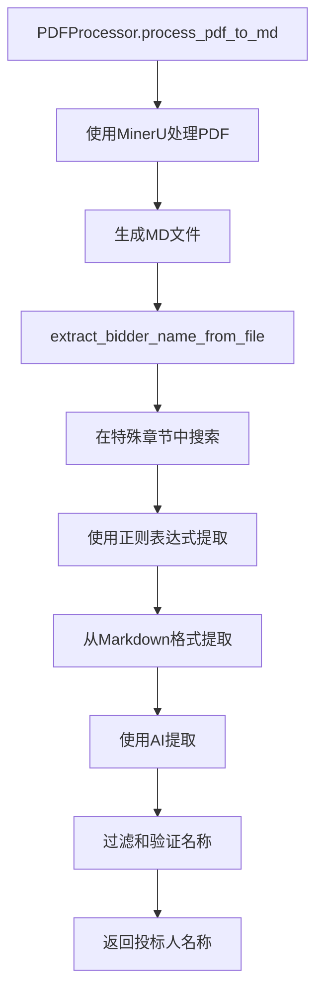

## 9. 智能投标分析流程（排除价格规则）

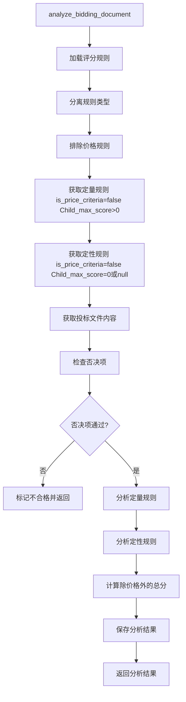

## 10. 价格规则特殊处理流程

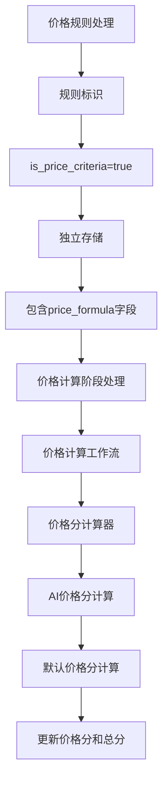

## 11. 统一提取器流程

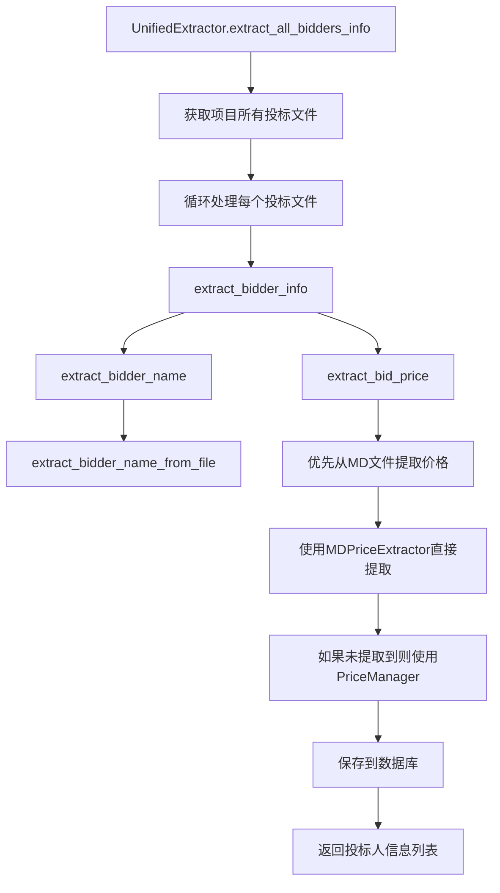

## 12. 价格计算工作流流程

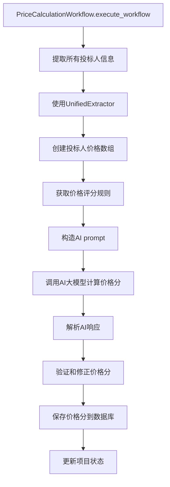

## 13. 进度监控流程

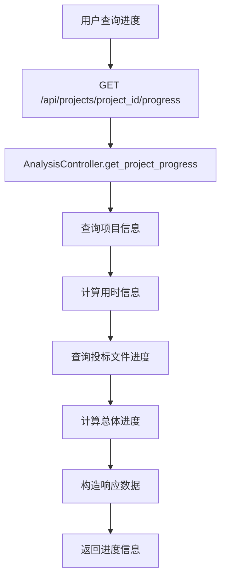

## 14. 结果展示流程

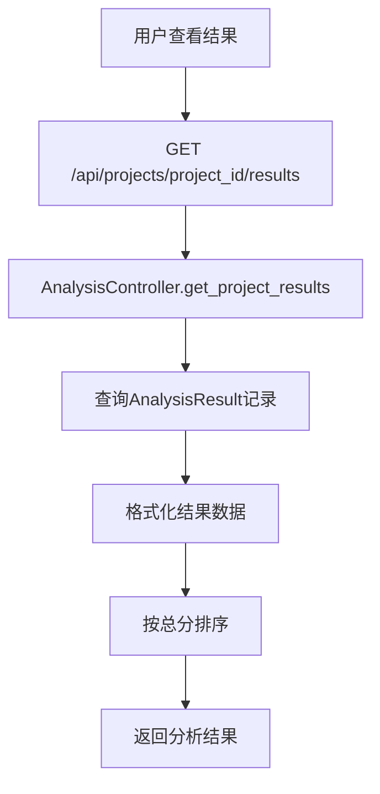

## 15. 规则处理分类流程

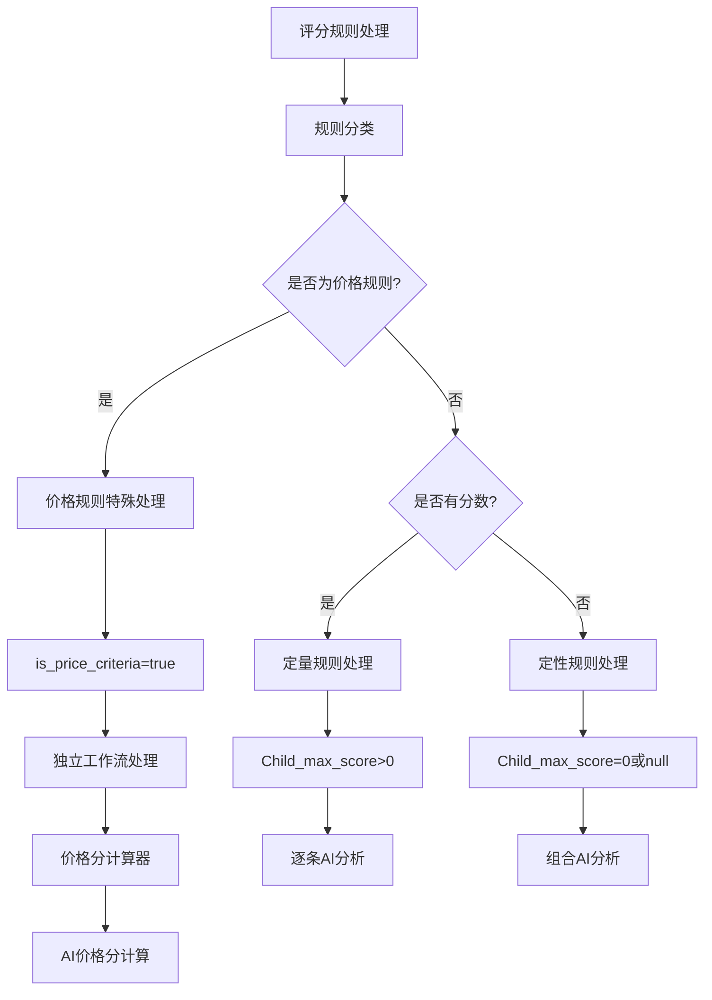

## 16. 数据库实体关系图

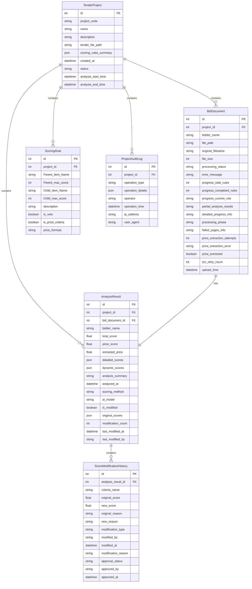
