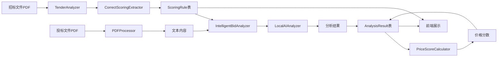
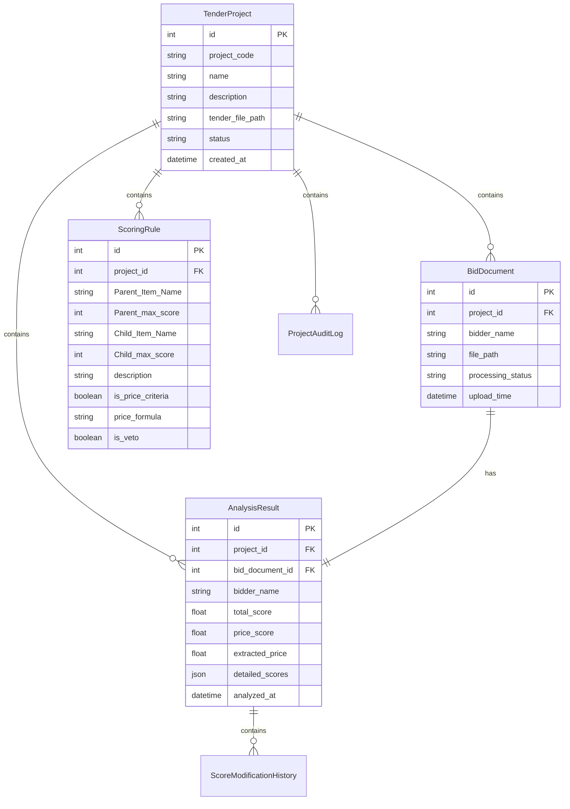

# AI_env2 项目需求与架构说明 (v4.0 完整版)

## 1. 项目概述

### 1.1 项目背景

AI_env2 是一个基于人工智能的投标文件评估系统，旨在通过自动化分析和评分提高评标效率和准确性。

### 1.2 目标用户

- 招标代理机构
- 政府采购部门
- 企业采购部门
- 需要处理大量投标文件的组织

### 1.3 核心问题

1. 人工评标效率低、耗时长
2. 评分规则提取和应用容易出错
3. 投标文件内容复杂，需要OCR和语义理解能力
4. 价格评分规则复杂，需要智能解析和计算

## 2. 系统功能

### 2.1 主要功能

1. 上传招标文件和投标文件（PDF格式）
2. 自动从招标文件中提取评分规则并保存到数据库
3. 使用本地AI模型（Ollama + qwen3）进行智能分析和评分
4. 展示评估结果汇总表
5. 提供详细的数据可视化分析（图表、可切换视图的详细表格）
6. 支持历史记录查看
7. 智能价格分计算

### 2.2 关键技术特性

- 支持中文OCR识别
- 使用本地AI模型保障数据隐私
- 支持价格分、技术分等多维度评分计算
- 智能解析复杂评分规则
- PDF文本缓存优化，避免重复OCR处理
- 清晰的多层表头结果展示与深入的数据分析功能

## 3. 技术架构

### 3.1 整体架构

基于 Flask 的前后端一体化架构，分层更清晰，并为路由拆分预留结构：

- **前端**：HTML/CSS/JavaScript + Jinja2 模板引擎 + Chart.js（仅在需要页面加载）
- **后端**：Python 3.10+ + Flask + Werkzeug
- **数据库**：SQLite（tender_evaluation.db）
- **AI模型**：Ollama 运行 qwen3:latest 模型
- **PDF处理**：全部使用MinerU，包括**OCR**

### 3.2 设计模式

- 工厂模式（用于模块初始化）
- 单例模式（数据库连接）
- 策略模式（评分规则提取与分析）
- 混入模式（功能模块化）

### 3.3 架构特点

- 分层架构（数据访问层、业务逻辑层、表示层）
- 模块化设计（评分规则提取、价格分计算、AI分析等独立模块）
- 向后兼容的模块化重构，单个文件不超过800行

## 4. 核心模块

### 4.1 数据库模块 (modules/database.py)

使用 SQLAlchemy ORM 实现数据库操作，主要数据表：

- **TenderProject**：招标项目信息
- **BidDocument**：投标文件信息
- **AnalysisResult**：分析结果
- **ScoringRule**：评分规则
- **ScoreModificationHistory**：评分修改历史
- **ProjectAuditLog**：项目审计日志

### 4.2 评分规则提取系统 (modules/correct_scoring_extractor.py)

模块化重构后的评分规则提取系统，负责从招标文件中解析出评分规则并存入数据库。

优化内容：

- 使用PyMuPDF直接从PDF中提取表格，不转换为txt或MD
- 删除多余代码，防止重复实现
- 优化评分规则名称和描述的清洗处理
- 改进重复规则检测机制，确保价格规则不会重复提取
- 优化max_score提取逻辑，直接从criteria_name的括号内提取分数
- 支持跨页表格合并处理
- 支持子项分值校验（子项分值之和应等于父项分值）

### 4.3 价格管理模块 (modules/price_manager.py)

- 价格信息提取和处理
- 价格分计算

### 4.4 智能投标分析模块 (modules/intelligent_bid_analyzer.py)

- 投标文件智能分析
- AI评分处理
- 价格提取和计算
- 进度跟踪和数据库更新

### 4.5 其他核心模块

- **PDF处理**：文本提取、并行页级提取、OCR处理、缓存机制优化（`modules/pdf_processor.py`）
- **结果展示**：动态汇总表（双层表头）生成（`modules/summary_generator.py`）
- **本地AI分析**：本地 AI 模型调用（`modules/local_ai_analyzer.py`）
- **投标方识别**：整合正则/AI/章节锚点/表格回退的统一流程（`modules/bidder_name_extractor.py`）

## 5. 系统完整流程

### 5.1 系统启动流程

```
启动Flask应用 (app.py)
├── 初始化数据库表
├── 创建上传目录
├── 配置静态文件和模板
└── 启动Flask服务器 (端口8000)
```

### 5.2 项目创建和文件上传流程

```
用户访问前端界面
├── 上传招标文件 (PDF)
│   ├── 保存到uploads目录
│   ├── 创建TenderProject记录
│   └── 自动调用initialize_project_analysis()
│
└── 上传投标文件 (PDF)
    ├── 保存到uploads目录
    ├── 创建BidDocument记录
    └── 等待分析启动
```

### 5.3 评分规则提取流程 (initialize_project_analysis)

```
initialize_project_analysis(project_id)
├── 获取项目信息
├── 检查招标文件是否存在
├── 使用CorrectScoringExtractor提取评分规则
│   ├── 直接从PDF文件中提取表格数据
│   ├── 处理跨页表格合并
│   ├── 解析评分规则结构
│   └── 清洗和验证规则数据
├── 使用ScoringRulesManager保存规则到数据库
└── 返回提取结果
```

### 5.4 投标文件分析流程 (run_analysis_and_calculate_prices)

```
run_analysis_and_calculate_prices(project_id, bid_files_info)
├── 获取所有投标文件
├── 为每个投标文件创建分析任务
│   └── 调用analysis_task()进行单个文件分析
     └── 保存每个单项规则到数据库

价格分析单独进行：
├── 获取所有投标文件中的投标总价
├── 将全部投标方和其对应的投标总价、价格分析公式或描述，发送给AI大模型，获取每个投标方的价格分
└── 保存每个投标方的价格分到数据库
```

### 5.5 单个投标文件分析流程 (analysis_task)

```
analysis_task(project_id, bid_document_id, tender_file_path, bid_file_path)
├── 更新投标文件状态为"processing"
├── 创建IntelligentBidAnalyzer
│   ├── 初始化PDF处理器
│   ├── 提取投标文件文本 (PDFProcessor.process_pdf_full_text)
│   └── 获取评分规则 (从数据库查询)
│
├── 执行AI分析 (analyze_bidding_document)
│   ├── 构建AI分析prompt
│   ├── 调用LocalAIAnalyzer.analyze_text()
│   ├── 解析AI响应获取评分结果
│   └── 提取投标人名称和投标总价
│
├── 保存分析结果到数据库
│   ├── 更新BidDocument记录
│   └── 创建/更新AnalysisResult记录
│
└── 更新状态为"completed"
```

### 5.6 AI分析详细流程 (IntelligentBidAnalyzer)

```
analyze_bidding_document()
├── 文本提取阶段
│   ├── 使用PDFProcessor.process_pdf_full_text()
│   ├── 支持OCR处理 (PaddleOCR/RapidOCR)
│   └── 保存文本到临时文件
│
├── 评分规则获取
│   ├── 从数据库查询ScoringRule表
│   └── 构建评分规则文本
│
├── AI分析阶段
│   ├── 构建完整prompt (规则+投标文件文本)
│   ├── 调用LocalAIAnalyzer.analyze_text()
│   ├── 解析AI响应获取JSON格式结果
│   └── 提取投标人名称、投标总价、评分结果
│
└── 结果保存
    ├── 更新BidDocument.bidder_name
    ├── 更新BidDocument.total_price
    └── 保存详细评分结果到AnalysisResult
```

### 5.7 价格分数计算流程

```
PriceScoreCalculator.calculate_project_price_scores()
├── 获取所有投标文件的价格
├── 从数据库获取价格评分规则
├── 构造发送给AI大模型的完整prompt
├── 调用AI大模型计算价格分
├── 解析AI响应获取价格分结果
├── 验证和修正价格分（确保不超过最高分）
└── 保存价格分数到数据库
```

### 5.8 前端展示流程

```
用户查看分析结果
├── 获取项目列表 (get_all_projects)
├── 获取分析状态 (get_analysis_status)
├── 获取分析结果 (get_analysis_results)
├── 获取评分规则 (get_scoring_rules)
└── 导出结果 (Excel/Word)
```

## 6. 核心模块关系图

```mermaid
graph TB
    A[app.py] --> B[routes/]
    A --> C[modules/analysis_manager.py]
    A --> D[modules/database.py]
  
    B --> B1[file_routes.py]
    B --> B2[project_routes.py]
    B --> B3[analysis_routes.py]
    B --> B4[config_routes.py]
    B --> B5[export_routes.py]
    B --> B6[rules_routes.py]
  
    C --> C1[initialize_project_analysis()]
    C --> C2[run_analysis_and_calculate_prices()]
    C --> C3[analysis_task()]
  
    C1 --> D1[TenderAnalyzer]
    D1 --> D2[CorrectScoringExtractor]
    D1 --> D3[ScoringRulesManager]
  
    C2 --> E1[IntelligentBidAnalyzer]
    C2 --> E2[PriceScoreCalculator]
  
    E1 --> E3[PDFProcessor]
    E1 --> E4[LocalAIAnalyzer]
  
    E2 --> E5[LocalAIAnalyzer]
  
    D --> D4[TenderProject]
    D --> D5[BidDocument]
    D --> D6[AnalysisResult]
    D --> D7[ScoringRule]
```

## 7. 数据流向图



## 8. 关键API端点

```
POST /api/init-upload - 初始化上传招标和投标文件
POST /api/projects/{project_id}/start-analysis - 开始分析
GET /api/projects/{project_id}/analysis-status - 获取分析状态
GET /api/projects/{project_id}/results - 获取分析结果
GET /api/projects/{project_id}/scoring-rules - 获取评分规则
GET /api/projects/{project_id}/export-excel - 导出Excel结果
GET /api/projects/{project_id}/export-word - 导出Word结果
GET /api/rules/system - 获取系统规则
GET /api/rules/system/enabled - 获取启用的系统规则
```

## 9. 数据库表关系



## 10. 关键技术实现

### 10.1 评分规则提取优化

- **表格结构识别**：使用PyMuPDF直接提取表格数据，增强单元格内容合并逻辑
- **分数识别**：添加有效性验证，支持范围分数解析
- **章节提取**：改进边界检测，确保只提取"评标办法"相关章节
- **数据清洗**：增强评分规则名称和描述的清洗处理，统一数据格式
- **跨页处理**：支持跨页表格合并处理
- **数据校验**：支持子项分值校验（子项分值之和应等于父项分值）

### 10.2 价格评分规则处理

- **智能解析**：不使用正则表达式提取价格计算公式的方法，将从招标文件中提取的评分规则中的价格规则存储到数据库中
- **公式存储**：数据库支持价格计算公式存储
- **强约束**：在全部投标人的投标文件分析结束后，启动价格计算流程：将全部投标人的投标总价和从数据库读取的当前项目的价格评分规则，合成一个完整的prompt，发给AI大模型，由AI大模型返回每家的价格分。不允许使用默认价格计算公式。若无法从评标办法中获得明确公式或AI生成失败，则价格分不计算，并在汇总中标注。发给AI大模型的prompt示例：

```
你是一个专业的评标专家，请根据以下信息计算各投标人的价格分：

【投标人报价信息】
投标人1：投标总价1,投标人2：投标总价2,投标人3：投标总价3,.......

【价格评价标准】
从数据库读取的价格评价规则描述

【价格分满分】
40分

【计算要求】
1. 根据价格评价标准计算每个投标人的价格分
2. 价格分必须是0-40之间的数字（满分为40分）
3. 最低价的投标人应该得到最高分（40分）
4. 严格按照价格评价标准中的计算公式进行计算

【重要】请严格按照以下JSON格式返回结果，不要返回任何解释文字：
{"投标人1": 价格分1, "投标人2": 价格分2, "投标人3": 价格分3}

示例（假设满分为40分）：
{"公司A": 38.2, "公司B": 40.0, "公司C": 35.3}
```

### 10.3 性能优化

- **PDF缓存**：使用文件哈希+元信息作为缓存标识，避免重复处理
- **并发提取**：页级并发提取，带页超时与总超时控制
- **价格提取**：价格一览表特殊处理；大小写金额对照验证；新增"保证金"独立提取并行级过滤，避免与总价混读
- **表格识别优化**：增强表格结构识别逻辑，确保跨页表格正确合并，保留表格原有的逻辑结构；优化投标一览表识别算法，提高表格数据提取准确性
- **中间目录**：创建temp_word目录保存由投标文件解析出的文本结果

### 10.4 结果展示优化

- **汇总表**：多层表头、内容可读性、水平滚动
- **详细分析视图**：价格与得分图表、详细评分表格

## 11. 数据处理流程

1. **初始化上传**：上传招标与投标文件，后端快速识别投标人名称并返回前端确认可编辑清单
2. **确认名称并启动分析**：前端确认后，写回数据库并启动后台分析与价格分计算
3. **结果呈现**：在前端生成汇总表。用户可点击"详细分析"按钮，查看价格对比图表和可切换视图的详细评分表

## 12. 开发与部署

### 12.1 环境要求

- **开发**：Python 3.10+、Tesseract OCR（中文语言包）、Ollama（qwen3模型）
- **部署**：Flask应用，确保Ollama服务运行

### 12.2 搭建步骤

```
git clone <repository_url>
cd AI_env2
pip install -r requirements.txt
python app.py
```

## 13. 技术约束与规范

### 13.1 代码规范

- 遵循 Python 标准编码规范，模块化设计
- 保持代码整洁，单个文件不超过800行

### 13.2 性能与安全

- AI分析耗时取决于硬件性能，使用本地模型保障数据隐私
- 文件上传需要验证格式与大小

### 13.3 数据结构与处理规范

#### 13.3.1 评分规则父子项关系处理

- 必须正确区分Parent_Item_Name（父项）和Child_Item_Name（子项）的关系
- 父项：Parent_Item_Name不为空，Child_Item_Name为空
- 子项：Parent_Item_Name和Child_Item_Name都不为空
- 构建评分规则树时应遵循的顺序：
  - 首先识别父项规则
  - 然后处理子项规则
  - 最后建立正确的父子项关联关系

#### 13.3.2 表头生成规范

- 表头为双层结构：第一行显示 `Parent_Item_Name`（父项），第二行显示 `Child_Item_Name`（子项）
- 父项单元格需根据其下属子项数量设置 `colspan` 进行合并
- "排名""投标方""价格分""总分"四列设置 `rowspan=2`
- 子项列头显示简称与满分，完整内容通过悬停提示显示

前端从动态汇总接口获取的数据结构建议：

```json
{
  "scoring_items": {
    "父项A": [{"name": "子项A1", "max_score": 10}, {"name": "子项A2", "max_score": 5}],
    "父项B": [{"name": "子项B1", "max_score": 20}]
  },
  "rows": [
    {"bidder_name": "投标人1", "scores": [..对齐各子项..], "price_score": 12.34, "total_score": 87.65}
  ]
}
```

#### 13.3.3 数据展示要求

- 数据行对应Child_Item_Name显示具体得分
- 价格分单独列为一列
- 总分计算包括所有Child_Item_Name得分和价格分
- 从analysis_result表的detailed_scores字段读取数据
- detailed_scores字段结构要求：
  - Parent_Item_Name：评分项父项名称
  - Child_Item_Name：评分项子项名称
  - score：AI模型给出的评分值
  - reason：AI模型给出的分析评论

#### 13.3.4 价格计算公式提取规范

- 价格计算公式从评标办法章节所在的表格中提取
- 价格项通常位于表格的最后一行
- 该行的"评价标准"单元格一般是空的，因为价格项只有父项没有子项
- 该行的第二列单元格本应该是子项的内容，但实际上内容是价格计算的方法
- 该单元格的内容就是要发送到AI大模型生成价格计算公式的内容
- 系统将该描述内容发送给AI大模型分析，提取或推断出价格计算公式
- AI分析完成后，将公式保存在数据库的price_formula字段中供后续价格分计算使用
- 错误处理与日志：在价格分计算阶段打印必要信息；规则提取阶段避免打印完整Prompt/响应，减少噪音。无法得到明确公式时严格禁止默认公式，并在汇总中标注"价格分未计算"

#### 13.3.5 总分计算规范

- 总分计算必须只包含Child_Item_Name对应的实际得分
- 计算流程规范：
  - 遍历每个子项得分并累加
  - 单独处理价格分
  - 使用计算得出的总分而不是直接使用数据库存储的总分
  - 在处理评分数据时，必须确保：
    - 只计算子项得分
    - 避免重复计算或错误计算
    - 区分价格分和其他评分项

#### 13.3.6 数据结构要求

- detailed_scores字段应是一个数组对象
- 数组中的每个元素应是一个字典对象，包含以下键：
  - Parent_Item_Name：评分项父项名称
  - Child_Item_Name：评分项子项名称
  - score：AI模型给出的评分值
  - reason：AI模型给出的分析评论

#### 13.3.7 数据处理规范

- 在处理detailed_scores数据时，应同时支持新旧两种数据格式
- 保持向后兼容性，确保旧数据格式仍可正常工作

#### 13.3.8 价格规则处理规范

- 价格规则应统一计算所有投标人的价格分，而不是针对单个投标人计算
- 在处理评分规则时，应明确区分价格规则和其他评分规则
- 对于价格规则的处理逻辑应独立封装，确保只计算一次
- 在价格分计算完成后，应确保正确保存相关结果
- 项目隔离与一致性：
- 统一计算与批量更新：
  - 价格分的计算在所有投标人完成评分分析后、项目级统一执行一次；
  - 数据库更新一次性批量写入当前项目下所有投标人的价格分与受影响的总分；
  - 禁止在单个投标人的分析流程中分别计算/分别保存价格分，避免重复与不一致
- 价格分计算与更新严格作用于当前 `project_id`。查询 `AnalysisResult`、`ScoringRule`、投标人报价等数据时，必须显式按 `project_id` 过滤
- 更新价格分时，需仅更新当前项目下的记录，严禁依据投标人名称跨项目匹配
- 同一项目中，同一 `bid_document_id` 仅保留一条分析结果；在写入前应删除该项目下该文档的旧记录以避免重复与混杂
- 汇总接口和结果接口返回的数据必须仅包含当前 `project_id` 的记录

### 13.4 前端展示规范

- 为提升表格内容的可读性和用户体验，前端表格应实现以下优化：
- 添加水平滑动条：当表格内容宽度超过容器宽度时，自动显示水平滚动条
- 表头自动换行：表头支持自动换行与悬停完整提示
- 模态框：历史页详情弹窗展示图表与各投标方详细表

## 14. 数据处理规范

### 14.1 招标文件处理规范

1. 招标文件是可编辑可搜索的PDF文件，直接使用PyMuPDF提取文本，并保存到word文档中。存储位置为：temp_word目录
2. 招标文件一次性提取出评分规则，并保存到数据库中，并将全部的评分规则优化成用于AI审核投标文件的依据的propmt的一部分
3. 评分规则提取流程严格按照以下步骤执行：
   - 系统首先从招标文件中提取评分规则
   - 提取的评分规则保存到数据库中，与项目ID关联
   - 后续对投标文件的分析都基于此评分规则进行

### 14.2 投标文件处理规范

1. 投标文件使用PyMuPDF提取文本，其中因为识别不了、有水印、有签名、加密等原因不能PyMuPDF提取处理数的页面改由据库使用RapidOCR处理器处理
2. 提取到的文本数据，按照合理的分块，与从数据库获取的评分规则一并生成一个prompt，发送到AI大模型进行分析，并保存每次分析的结果，最终合并处理返回结果
3. 同一投标人的每一块文字分析得到的同一评分规则的得分可以加到现有数据库该投标人的该规则的得分分数上，形成新的分数

### 14.3 AI分析处理规范

1. 每一家投标文件的公司名称提取、投标总价提取和评分规则打分应在提取文本内容后合并进行，作为一次AI分析任务完成
2. 由于投标文件文本较长，为避免一次性发送过长文本给AI大模型导致处理失败，需要将投标文件分块处理，每块分别与评分规则合并成一个prompt发送给AI大模型进行分析，并保存每次分析的结果，最终合并处理返回结果
3. 送给AI模型的完整Prompt应包含评分规则和投标方的投标文本内容，格式如下：

```
你是一个资深评标专家，现在需要根据如下评分规则：
{
    规则名称1：，本项最高分，评分标准 ；
    规则名称2：，本项最高分，评分标准 ；
    规则名称2：，本项最高分，评分标准 ；
    ......
},投标方的投标文本内容为：
『投标方投标文本内容』
请分析该投标文本，分析出该投标方的投标人名称、投标总价，并根据评分规则，对投标方投标文本内容进行打分，并给出每一项评分结果，请返回一个json格式的打分结果，格式如下：
{
    "投标人名称": "投标方公司名称",  
    "投标总价": "投标总价",  
    "评分结果": [
        {
            "规则名称1": "50分",
            "规则名称2": "50分",
            ......
        }
    ]
}，其中投标方名称和投标总价为必填项，都可以在投标一览表"提取，其中投标人名称在授权委托书等多处可以提取，需要前后多次提取进行对比验证。而投标总价在投标一览表中，该表可能同时还有投标保证金，也是数字，注意避免二者不能混淆，投标总价同时有汉字大写，需要转换为数字，与从数字提取的投标报价进行对照核实。
```

4. AI分析应同时完成投标人名称提取、投标总价提取和评分分析三项任务，并将结果存储到数据库中

### 14.4 PDF处理优化规范

1. **表格结构识别增强**：优化PyMuPDF表格识别逻辑，确保跨页表格正确合并，保留表格原有的逻辑结构
2. **投标总价提取优化**：在识别出投标一览表后，优先从表格的"投标总价"列的数据单元格读取，该单元格通常会有（小写）跟着一串数字，然后还有（大写）跟着一串中文数字，这样的数字和汉字数字是投标总价格，可以中文和阿拉伯数字进行互相核对
3. **保证金过滤机制**：在投标一览表中，投标保证金也是数字，但通常金额会远小于投标报价，而且投标保证金没有中文大写。据此优化代码，有效过滤掉保证金等干扰项
4. **流式处理优化**：投标文件上传后应立即开始使用PyMuPDF或RapidOCR、paddleocr处理，处理完设定数量的页面后立即喂给AI大模型分析，而不是等待全部处理完成后再发送给大模型，以减少等待时间
5. **边处理边分析**：PDF处理器应实现流式处理机制，在提取到足够文本内容后立即触发AI分析，无需等待整个文档处理完成
6. **增量式AI分析**：AI分析器应支持增量式处理，能够接收部分文本内容进行分析，并在后续接收到更多内容时更新分析结果
7. **处理进度跟踪**：在PDF处理过程中应实时更新处理进度，让用户了解当前处理状态

## 15. 测试与验证

- 功能完整性、数据准确性、UI交互、向后兼容性测试

## 16. 未来改进方向

- 增强AI模型准确性，优化性能
- 增加测试用例，完善错误处理
- 支持更多文件格式，增强UI交互

## 17. 版本更新记录

### 17.1 v3.3 更新 (2025-09-14)

- **后端**：调整 `detailed_scores` 字段的JSON结构为键值对字典，与价格分计算解耦
- **前端**：初步重构汇总表格，修复了因后端数据结构变更导致的JS错误

### 17.2 v3.4 审查与优化 (2025-09-14)

- **前端**：通过JS和CSS修复，彻底实现了双层表头、内容缩略、悬停提示和水平滚动条功能
- **文档**：同步更新功能描述，并结构化版本记录

### 17.3 v3.5 数据可视化增强 (2025-09-14)

- **前端**：
  - **引入Chart.js库**：为项目添加了图表绘制能力
  - **实现详细分析模态框**：新增了"图表与详细分析"功能，通过模态框展示
  - **价格对比图表**：在新模态框中，增加了投标报价与价格得分的条形对比图
  - **可切换评分表**：实现了详细评分表，并提供"按子项/父项"切换视图的功能，便于深度分析
- **文档**：将新增的数据可视化功能更新到项目需求和功能说明中

### 17.4 v3.6 评分规则与表格展示优化 (2025-09-14)

- **后端**：
  - 修正了result_display.py和summary_generator.py中的数据处理逻辑，确保正确处理detailed_scores字段中的父子项关系
  - detailed_scores字段现在是一个数组对象，每个元素是一个字典对象，包含Parent_Item_Name、Child_Item_Name、score、reason键
  - 修复了总分计算逻辑，确保只计算子项得分和价格分

### 17.5 v3.7 价格规则处理优化 (2025-09-14)

### 17.6 v3.8 数据一致性与展示修正 (2025-09-15)

### 17.7 v3.9 架构与体验优化 (2025-09-17)

- 新增"名称确认"两步流程：`/api/init-upload` 与 `/api/projects/{id}/start-analysis`；前端先确认可编辑投标人名称再开始分析
- 历史页详情新增图表与详细表，并修复"价格分/总分"表头缺失
- 名称提取整合：在单一流程内融合正则→AI→表格回退→章节锚点回退，新增"制造商名称/制造厂家/生产厂家"字段的回退提取
- **文档**：
  - 明确禁止价格分默认公式回退；缺公式时不计算价格分并在汇总中标注
  - 明确双层表头规范（父/子两层，四固定列rowspan=2，父项按子项合并列）
  - 新增项目隔离与一致性规范：所有查询/更新必须显式按 `project_id` 过滤；同一项目+同一 `bid_document_id` 仅保留一条分析结果；汇总/结果接口仅返回当前项目数据
- **后端（说明变更）**：规则落表时父项写 `Parent_Item_Name`，子项写 `Child_Item_Name` 并携带父项名；价格分计算仅基于当前项目的 `AnalysisResult` 且一次性批量更新；写入分析结果前清理当前项目下对应文档的旧记录；规则提取阶段不再打印完整AI Prompt/响应，避免重复日志
- **后端**：
  - 修复了价格规则重复计算的问题，确保价格规则只计算一次而不是对每个投标人重复计算
  - 为BidDocument数据模型添加了price_extraction_attempts、price_extraction_error和price_extracted字段，用于跟踪价格提取状态
  - 重构了价格分计算逻辑，改为统一计算所有投标人的价格分
- **数据库**：
  - 更新了BidDocument表结构，添加了价格提取相关的跟踪字段

### 17.8 v3.10 数据处理流程更新 (2025-09-21)

- 新增中间目录temp_word用于保存PDF文件解析出的文本结果
- 更新招标文件和投标文件处理流程，明确处理规范
- 优化AI审核流程，将评分规则作为prompt的一部分

### 17.9 v3.11 AI分析流程优化 (2025-09-21)

- 优化投标人名称提取逻辑，与评分分析合并进行
- 更新AI分析Prompt格式，同时提取投标人名称和评分结果
- 修改分析结果数据结构以适应新的输出格式

### 17.10 v3.12 AI分析流程优化 (2025-09-21)

优化AI分析流程，实现分块处理长投标文件文本

每块分别与评分规则合并成prompt发送给AI大模型分析，避免一次性发送过长文本

保存每次分析的结果，最终合并处理返回结果

更新AI分析Prompt格式，提高处理大文件的稳定性

使用统计方法选择最可靠的投标人名称和投标总价

改进评分结果合并逻辑，确保同一评分规则的得分正确累加

### 17.11 v3.13 PDF处理流程优化 (2025-09-21)

优化投标文件PDF处理流程，实现流式处理机制

文件上传后立即开始使用PyMuPDF或RapidOCR处理，处理设定的页面就喂给AI大模型分析，无需等待全部处理完成

新增PDF处理优化规范，明确流式处理、边处理边分析、增量式AI分析等要求

更新数据处理流程，支持实时处理进度跟踪

### 17.12 v3.14 表格识别与价格提取优化 (2025-09-21)

优化PDF表格识别和投标总价提取功能

增强表格结构识别逻辑，确保跨页表格正确合并，保留表格原有的逻辑结构

优化投标总价提取算法，在识别出投标一览表后，优先从表格的"投标总价"列的数据单元格读取，实现小写和大写价格对照验证

增强保证金过滤机制，有效过滤掉投标保证金等干扰项，提高价格提取准确性

更新项目需求与架构说明文档，新增PDF处理优化规范 (v3.14 新增 - 表格与价格提取优化)

### 17.13 v3.15 评分规则提取流程优化 (2025-09-21)

优化评分规则提取流程，明确规则提取顺序

确保评分规则严格按照"从招标文件提取→保存到数据库→投标文件分析基于此规则"的流程执行

更新项目需求与架构说明文档，明确评分规则提取流程规范

修复流式处理回调中的页面文本传递问题

优化AI分析页面数量限制配置传递机制

修复OCR GPU配置传递问题

更新临时文件处理路径，确保文件保存到正确目录

### 17.14 v3.16 评分规则数据清洗优化 (2025-09-22)

优化评分规则提取模块的数据清洗功能：

- 使用TableAnalyzer模块直接读取评分规则章节的表格信息来提取评分规则，避免重复实现
- 优化评分规则名称和描述的清洗处理：
  - 将中文标点符号替换为对应的英文标点符号
  - 去除不必要的空格，包括规则名称中词语间的空格
  - 去除括号内数字和"分"之间的空格
  - 对description字段也应用相同的清理规则
- 改进重复规则检测机制，确保价格规则不会重复提取
- 优化max_score提取逻辑，直接从criteria_name的括号内提取分数
- 删除多余代码，防止重复实现

更新项目需求与架构说明文档，添加评分规则提取优化相关内容

### 17.15 v4.0 评分规则提取重构 (2025-10-05)

重构评分规则提取模块，采用全新的CorrectScoringExtractor实现：

- 使用PyMuPDF直接从PDF中提取表格，不转换为txt或MD
- 支持跨页表格合并处理
- 支持子项分值校验（子项分值之和应等于父项分值）
- 改进文本清洗逻辑，彻底清理空格和换行符
- 改进价格项处理逻辑，正确保存价格项描述信息
- 支持子项名称、最高分值、描述三部分解析
- 支持价格项公式提取和描述保存
- 修复跨页表格合并问题
- 修复子项提取不完整问题
- 修复文本清理不彻底问题
- 修复表头处理问题
- 添加系统规则管理功能，确保代码规范遵守
